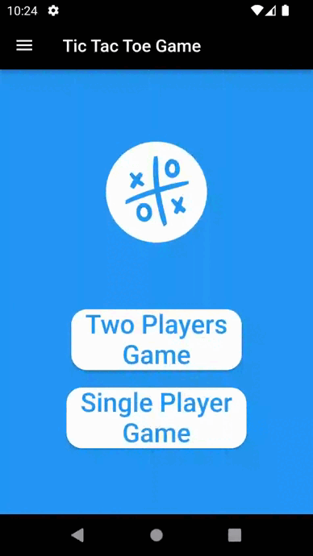

# XO Game

This game was made through my third year studies in the Hashemite University as a personal project.

In which, I decided to code an X/O game in flutter, which will contain the following features:
 - Three main screens(homepage, single and two players)
 - AI with two difficulties (medium & hard)
 - Resetting score, and changing difficulty methods

Attached you will find the final form of the game:

